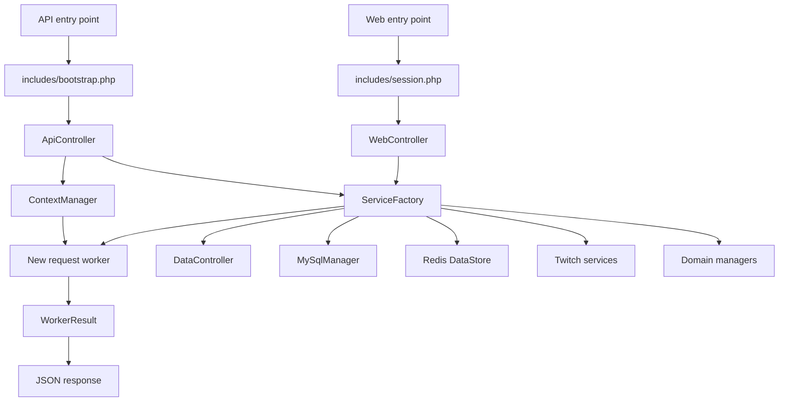

# Xogoria

Xogoria is the website and stream-interaction platform for the Xogoria community. It combines a public content site, Twitch authentication, viewer-funded game interactions, stream quotes, clip review, a Redis-backed sound queue, and an administrator control center in one PHP application.

The project is written for PHP 8.4 and uses a deliberately small application architecture built around controllers, request contexts, workers, managers, and service composition. Public web requests render server-side PHP pages; API requests return structured JSON.

> [!IMPORTANT]
> This repository is under active development. Review the deployment and security notes before exposing a new installation publicly. A database schema/migration package is not currently included, so a fresh clone is not yet a one-command installation.

## Contents

- [Features](#features)
- [Technology](#technology)
- [Architecture](#architecture)
- [Project structure](#project-structure)
- [Requirements](#requirements)
- [Installation](#installation)
- [Private configuration](#private-configuration)
- [Database](#database)
- [Application configuration](#application-configuration)
- [Twitch setup](#twitch-setup)
- [Administrator access](#administrator-access)
- [API overview](#api-overview)
- [Development workflow](#development-workflow)
- [Testing](#testing)
- [Deployment](#deployment)
- [Security](#security)
- [Troubleshooting](#troubleshooting)
- [Repository publication notes](#repository-publication-notes)
- [License](#license)

## Features

### Public site

- About and channel information
- Stream feature documentation
- Searchable command collection
- Searchable stream quotes
- Twitch clip collection for the website and stream overlays
- Shared navigation, authentication state, and live-stream banner

### Viewer interaction

- Sign in with Twitch OAuth
- Local user profiles linked to Twitch identities
- Airo Gem balances used for stream interactions
- Game- and profile-specific interaction panels
- Configurable effects, sounds, pranks, spawns, and command sequences
- Server-side interaction workers and consistent JSON results

### Administration

- Role-gated administrator control center
- CSRF-protected mutations
- Allowlisted CRUD for users, commands, and quotes
- JSON editors for core, Twitch, Minecraft, and Hytale configuration
- Timestamped configuration backups
- Clip lifecycle management: pending, approved, ignored, and deletion requested
- Manual deletion queue that preserves provider links when external deletion is still required

### Integrations

- Twitch OAuth, user lookup, chat, streams, and clips
- MySQL application storage
- Redis sound queue and expiring data
- External game-panel command relay
- Optional Backblaze-oriented clip storage code

## Technology

| Layer | Technology |
|---|---|
| Server | PHP 8.4 |
| Web UI | Server-rendered HTML, CSS, JavaScript, jQuery |
| Database | MySQL 8-compatible schema through `mysqli` |
| Temporary data | Redis with the PHP Redis extension |
| Dependency management | Composer |
| Authentication | Twitch OAuth 2.0 |
| HTTP integrations | PHP cURL and HTTP stream requests |
| Local web stack | Nginx + PHP-FPM, with optional Docker Compose files |

## Architecture

Xogoria separates ordinary page rendering from API execution.



### Request flow

Web pages load `html/includes/session.php`. That file bootstraps the application, creates a `ServiceFactory`, and exposes a `WebController` for page-level data and shared services.

API entry points load `html/includes/bootstrap.php` and delegate execution to `ApiController`. The controller:

1. Collects request and session input through `ContextManager`.
2. Authenticates requests that supply an external identity.
3. Refreshes the current user context.
4. Requests a new worker from `ServiceFactory`.
5. Primes the worker with request and worker contexts.
6. Executes the worker.
7. emits its `WorkerResult` as JSON.

`ServiceFactory` owns the application object graph. Entry points should not manually assemble managers, bridges, or controllers.

### Worker contract

Every API worker implements `WorkerInterface` and returns a `WorkerResult`. Expected validation failures should use `WorkerResult::failure()` instead of echoing output or throwing an unhandled exception.

A typical JSON result has this shape:

```json
{
  "success": true,
  "value": {},
  "message": "",
  "code": "",
  "meta": {}
}
```

## Project structure

```text
Xogoria/
|-- html/                         Web document root
|   |-- _core/                    Active application classes
|   |   |-- _init/                Controllers, factory, config, and logging
|   |   |-- bridges/              MySQL, Twitch, and external providers
|   |   |-- catalogs/             Typed command and quote containers
|   |   |-- contexts/             Request-scoped application data
|   |   |-- dataCollection/       Request and session readers
|   |   |-- elements/             Domain objects
|   |   |-- managers/             Domain and persistence operations
|   |   |-- subControllers/       Data, Twitch, and user controllers
|   |   |-- tools/                cURL, Redis, JSON, and file utilities
|   |   `-- workers/              API request handlers
|   |-- admin/                    Administrator UI
|   |-- api/                      JSON API entry points
|   |-- assets/                   CSS, JavaScript, fonts, images, and audio
|   |-- includes/                 Bootstrap, session, and shared page parts
|   |-- libs/templates/           HTML templates for games and site content
|   `-- *.php                     Public page entry points
|-- private/                      Untracked secrets
|-- tests/                        Smoke checks
|-- docker/                       Optional local container configuration
|-- composer.json                 Composer dependency and autoload config
`-- README.md
```

`html/_core` is the only source of active application classes. Archived or old core directories are not part of the runtime architecture.

## Requirements

### Required runtime

- PHP 8.4
- Composer 2
- MySQL 8 or a compatible server
- Redis
- A web server configured with `html/` as its document root
- A Twitch developer application for authentication and Twitch-backed features

### Required PHP extensions

- `curl`
- `json`
- `mbstring`
- `mysqli`
- `openssl`
- `redis`
- `session`

Useful checks:

```bash
php -v
php -m
composer --version
```

## Installation

### 1. Clone the repository

```bash
git clone <your-repository-url> xogoria
cd xogoria
```

Before relying on these instructions from a fresh clone, read [Repository publication notes](#repository-publication-notes) and confirm that all required setup files are included in the published repository.

### 2. Install Composer dependencies

```bash
composer install
composer dump-autoload -o
```

The optimized classmap is important because application classes are loaded from `html/_core`.

### 3. Create the private configuration

Create `private/privateConfig.json` using the structure in [Private configuration](#private-configuration). Never commit that file.

### 4. Prepare MySQL

Create a database and application user, import the project schema, and update the `database` section of `privateConfig.json`.

The current repository does not include canonical migrations or a schema dump. Existing installations must supply tables compatible with [Database](#database).

### 5. Prepare Redis

Start Redis and configure its host and port. The sound queue and other expiring/list data use the native PHP Redis extension.

### 6. Configure Twitch

Create a Twitch application, configure the exact OAuth callback URL, and add the client credentials and broadcaster identifiers to the private configuration. See [Twitch setup](#twitch-setup).

### 7. Configure the web server

Point the server document root to the repository's `html/` directory. The application expects root-relative URLs such as `/about.php`, `/api/xogoriaApi.php`, and `/assets/...`.

For Nginx with PHP-FPM, the essential shape is:

```nginx
server {
    listen 80;
    server_name localhost;
    root /path/to/xogoria/html;
    index about.php index.php index.html;

    location / {
        try_files $uri /about.php?$query_string;
    }

    location ~ \.php$ {
        include fastcgi_params;
        fastcgi_param SCRIPT_FILENAME $document_root$fastcgi_script_name;
        fastcgi_pass 127.0.0.1:9000;
    }
}
```

Use HTTPS and production-appropriate PHP-FPM/socket settings outside local development.

### 8. Set writable paths

The PHP/web-server user needs controlled write access to:

- `html/_core/_init/_logs/`
- `html/_core/_init/config/core.json`
- `html/_core/_init/config/clipDeletionQueue.json`
- `html/_core/_init/config/_backups/` when the admin configuration editor is used

Do not make the entire repository globally writable.

### 9. Open the site

For the supplied local Nginx convention, visit:

```text
http://localhost:8080/about.php
```

### Optional Docker workflow

If `docker-compose.yml` and `docker/` are included in your copy, they define Nginx, PHP-FPM 8.4, MySQL 8, and Redis services.

```bash
docker compose build
docker compose up -d
docker compose logs -f
```

Before starting the stack:

- replace all example/development database passwords;
- configure the private database host as the Compose service name, normally `db`;
- configure Redis host as `redis`;
- run `composer install` so the bind-mounted application contains `vendor/`;
- do not expose MySQL or Redis ports publicly in production.

## Private configuration

Secrets are loaded from `private/privateConfig.json`. The `private/` directory is ignored by Git and should also be denied by the web server and excluded from public artifacts.

Use this placeholder structure:

```json
{
  "database": {
    "host": "db",
    "user": "xogoria",
    "pass": "replace-with-a-strong-password",
    "name": "xogoria",
    "port": 3306
  },
  "apiData": {
    "webApiKey": "replace-with-a-long-random-value",
    "panelBaseUrl": "https://panel.example.com",
    "serverPath": "/api/client/servers/your-server/command",
    "panelApiKey": "replace-with-panel-token"
  },
  "twitch": {
    "broadcasterId": "123456789",
    "clientId": "replace-with-twitch-client-id",
    "clientSecret": "replace-with-twitch-client-secret",
    "token": "optional-fallback-token",
    "editorId": "123456789"
  },
  "redis": {
    "host": "redis",
    "port": 6379
  },
  "core": {
    "devMode": true
  }
}
```

Clip retrieval uses the Twitch client-credentials flow and caches its app access token outside the web root. The optional `token` value is used only when a client secret is unavailable.

Generate API keys with a cryptographically secure source. For example:

```bash
php -r "echo bin2hex(random_bytes(32)), PHP_EOL;"
```

Never place access tokens, client secrets, database passwords, or API keys in source files, screenshots, issues, logs, or README examples.

## Database

The active code references these tables:

| Table | Purpose |
|---|---|
| `users` | Twitch identity, display name, role, and Airo Gem balance |
| `collectCommands` | Public stream commands |
| `collectQuotes` | Collected stream quotes |
| `streamClips` | Clip review state, display metadata, and play counts |

The exact fields used by admin-managed resources are defined in:

```text
html/_core/_init/config/adminResources.json
```

Collection queries are defined in:

```text
html/_core/_init/config/sql.json
```

### Schema warning

A canonical SQL schema and migrations are not currently tracked. Do not infer a production schema only from UI fields: indexes, unique constraints, foreign keys, defaults, transactions, and charset settings are also part of the contract.

For reproducible installations, add versioned migrations or a sanitized schema before publishing a release.

Use `utf8mb4` for application tables and connections.

## Application configuration

Non-secret configuration lives in `html/_core/_init/config`.

| File | Responsibility |
|---|---|
| `core.json` | Active game and interaction profile |
| `twitch.json` | Twitch endpoint URLs and OAuth callback paths |
| `sql.json` | Named collection queries |
| `adminResources.json` | Admin CRUD allowlist and field-rendering schema |
| `gameConfigs/minecraft.json` | Minecraft interaction types, actions, and profiles |
| `gameConfigs/hytale.json` | Hytale interaction types, actions, and profiles |
| `clipDeletionQueue.json` | External links retained for requested/manual deletion |

Credentials do not belong in these files.

### Adding or changing a game interaction

1. Update the appropriate game configuration.
2. Reuse an existing interaction type/template when its contract fits.
3. Add templates under `html/libs/templates/<game>/interact/` only when required.
4. Keep cost, duration, cooldown, enabled state, and command data in configuration.
5. Validate the request at the worker/domain boundary.
6. Test with a non-production panel and account before enabling it.

### Adding an admin-managed resource

Add the table and field definition to `adminResources.json`. `AdminResourceManager` is the allowlisted CRUD boundary; do not add ad hoc table forms or accept arbitrary client-provided table/column names.

## Twitch setup

1. Create an application in the Twitch developer console.
2. Set the OAuth redirect URL to exactly match the configured callback.
3. For local development, the current default callback is:

   ```text
   http://localhost:8080/_core/bridges/twitch/auth/TwitchCallback.php
   ```

4. For production, update `authCallbackProdPath` in `twitch.json` to the HTTPS site URL.
5. Store the client ID and secret in `private/privateConfig.json`.
6. Confirm the requested scopes match the features you intend to use.

The OAuth flow begins at `TwitchAuthStart.php`, validates the callback state, exchanges the code, loads the Twitch user, and synchronizes a local `users` record.

## Administrator access

Admin routes require an authenticated local user whose database role is `admin` or `owner`.

For the first installation:

1. Complete Twitch login once so the application creates the local user.
2. Promote that known Twitch user directly in the database using a controlled one-time operation.

   ```sql
   UPDATE users
   SET role = 'owner'
   WHERE platformUserId = 'YOUR_TWITCH_USER_ID';
   ```

3. Sign out and back in if the current session does not immediately reflect the updated role.
4. Open `/admin/manageXogoria.php`.

Do not create a public “first admin” endpoint. Remove direct production database access after bootstrap if it is no longer required.

Admin mutations use `/api/admin.php` and `/api/clips/clipsAdmin.php`; both require an admin session and the session CSRF token.

## API overview

### General worker endpoint

```text
POST /api/xogoriaApi.php
```

The `request` field selects a worker:

| Request | Worker | Responsibility |
|---|---|---|
| `quote` | `QuoteWorker` | Retrieve stream quotes |
| `currency` | `CurrencyWorker` | Balance operations |
| `interaction` | `InteractionWorker` | Validate and execute game interactions |
| `configure` | `ConfigureWorker` | Change active game/profile for authorized users |

Requests can be form encoded or JSON. External identities require the configured private API key. Session-backed browser requests use the logged-in Twitch identity.

Treat worker actions as internal application contracts until they have dedicated public API documentation and authorization tests. Do not expose privileged mutation actions to untrusted clients.

### Other endpoints

| Endpoint | Method | Purpose |
|---|---|---|
| `/api/admin.php` | POST | CSRF-protected admin resource/config mutations |
| `/api/clips/clipsApi.php` | GET | Public approved clip collection |
| `/api/clips/clipsPlay.php` | GET/POST | Record clip playback |
| `/api/clips/clipsAdmin.php` | GET/POST | Admin clip review and metadata |
| `/api/soundQueue/pop.php` | GET | API-key-protected Redis queue consumer |

The sound queue API expects the key in `X-API-Key` and supports a bounded `timeout` query parameter for long polling.

## Development workflow

### Coding conventions

- Target PHP 8.4.
- Use typed properties, parameters, and return values where practical.
- Prefer constructor property promotion and composition over inheritance.
- Keep application classes under `html/_core`.
- Let `ServiceFactory` create and share services.
- Validate at request, authorization, and persistence boundaries.
- Return domain failures through `WorkerResult::failure()`.
- Do not echo from workers or managers.
- Use the existing `Logger` for immediate structured logging.
- Include useful operational context, but never log secrets or tokens.
- Keep values that vary by game/environment in configuration rather than hard-coded branches.
- Preserve pending, approved, ignored, and deletion-requested clip states as distinct lifecycle states.

### Adding or moving classes

Regenerate the optimized Composer classmap:

```bash
composer dump-autoload -o
```

### Logs

Structured application logs are separated into channels under:

```text
html/_core/_init/_logs/
```

- `common.log`
- `web.log`
- `api.log`

Production logs should be writable by the application, unreadable from the public web, rotated, monitored, and excluded from source control.

Set `XOG_DISPLAY_ERRORS=1` only for controlled local development. Production should leave PHP error display disabled and rely on logs/monitoring.

## Testing

### PHP syntax

PowerShell:

```powershell
Get-ChildItem html -Recurse -Filter *.php |
    ForEach-Object { php -l $_.FullName }
```

Bash:

```bash
find html -name '*.php' -print0 | xargs -0 -n1 php -l
```

### Smoke test

```bash
php -d zend.assertions=1 -d assert.exception=1 tests/smoke.php
```

The smoke test checks core object construction, request-scoped service reuse, admin configuration loading, clip deletion state, and `WorkerResult` behavior. It is not a replacement for database, Redis, Twitch, browser, or external-panel integration tests.

### Recommended release checks

- Composer optimized autoload generation
- PHP lint for every changed PHP file
- JSON decoding for every changed configuration file
- Smoke test with assertions enabled
- Disposable MySQL integration tests
- Disposable Redis queue/cooldown tests
- Twitch OAuth and expired-token tests
- Mocked Twitch/panel HTTP status and timeout tests
- Admin add/edit/delete tests for every allowlisted resource
- Browser tests for every form, tab, filter, media control, and error state
- OBS/browser-source soak testing for clip rotation
- Concurrent balance and interaction requests
- Backup and restore drill

## Deployment

### Production checklist

- Serve only `html/` as the document root.
- Use HTTPS and redirect all HTTP traffic.
- Disable PHP error display.
- Set secure session cookie options (`Secure`, `HttpOnly`, and an appropriate `SameSite` policy).
- Deny web access to `private/`, source-control metadata, logs, backups, Docker files, and development tools.
- Remove or block diagnostic pages such as `phpinfo()` before launch.
- Install and verify `mysqli`, cURL, and Redis PHP extensions.
- Use least-privilege database and external-service credentials.
- Keep MySQL and Redis on private networks.
- Confirm Twitch production callback URLs and scopes.
- Make configuration/log paths writable without making source code writable.
- Configure log rotation and error monitoring.
- Back up the database and configuration before deployment.
- Test rollback before the first public release.

### Post-deploy health checks

At minimum, verify:

- About, Features, Quotes, Commands, Clips, and Interact pages render.
- Static assets return 200 with the expected content types.
- Twitch login, callback, local user synchronization, and logout work.
- Admin access is denied for ordinary users.
- Admin resource lists and configuration editors load.
- MySQL and Redis failures are visible to monitoring.
- Clip and interaction integrations fail safely when external services are unavailable.
- Logs contain useful request context but no credentials.

## Security

This application handles OAuth tokens, account roles, virtual currency, administrative database writes, and commands sent to an external game server. Treat those as security-sensitive boundaries.

- Never commit `private/privateConfig.json`.
- Never trust client-provided price, cooldown, role, table name, column name, or external identity.
- Require explicit authorization for every mutation, not only for the route as a whole.
- Keep CSRF protection on session-backed admin mutations.
- Escape output according to HTML, attribute, URL, and JavaScript context.
- Allow only local, validated post-login redirect targets.
- Rotate the session ID after successful OAuth.
- Use atomic/transactional balance updates for concurrent interactions.
- Verify external HTTP status, response shape, timeout, and partial-failure behavior.
- Do not report provider deletion as complete until the provider confirms it.
- Rate-limit public and costly endpoints at both application and reverse-proxy layers.
- Keep diagnostic endpoints out of production.

If publishing the repository, use GitHub's private vulnerability reporting or provide a dedicated security contact before accepting external reports. Avoid filing public issues that contain active credentials or exploitable production details.

## Troubleshooting

### `Class ... not found`

Regenerate the Composer classmap:

```bash
composer dump-autoload -o
```

Confirm the class is under `html/_core` and that its filename/class name is unambiguous.

### Pages render with no database content

Check:

- the `mysqli` extension is installed;
- database host, port, credentials, and database name;
- the PHP process can reach MySQL;
- expected tables/columns exist;
- application logs for connection or query failures.

### Redis queue fails

Check:

- the PHP Redis extension is installed;
- Redis is running and reachable;
- the configured host is `redis` inside Compose or the correct hostname outside it;
- web/PHP worker timeouts accommodate the requested long poll.

### Twitch login redirects with an error

Check:

- callback URL matches Twitch exactly;
- client ID and secret belong to the same application;
- PHP sessions persist across auth start/callback;
- system clock is correct;
- requested scopes are permitted;
- web logs contain the non-secret failure reason.

### Admin page returns access denied

Confirm the Twitch user exists in `users`, the role is `admin` or `owner`, and the user has refreshed their authenticated session since the role changed.

### Configuration changes do not take effect

Confirm the correct config was saved, active game/profile names exist, the PHP user can replace the file and create backups, and any long-running consumers have been restarted.

## Repository publication notes

Before publishing, verify that the files needed to reproduce the application are actually tracked. At minimum, a typical PHP application repository should track:

- `composer.json`
- `composer.lock` for an application
- sanitized Docker/web-server configuration, if Docker setup is documented
- contributor/development documentation intended for collaborators
- a database migration set or sanitized schema
- a private configuration example containing placeholders only

Continue ignoring:

- `private/`
- `vendor/` (dependencies should be restored with Composer)
- local IDE/workspace files
- local-only tool configuration
- runtime logs and backups
- archives and internal reports
- real credentials and tokens

Prefer root-anchored ignore rules when a filename also occurs inside dependencies. For example, ignoring `/composer.json` affects only the repository root, while ignoring `composer.json` can also hide or expose manifests nested under `vendor/` depending on later changes.

Before the first public push, review the entire Git history as well as the current files for secrets. Removing a secret from the latest commit does not remove it from history; rotate any credential that has ever been committed or shared.

## License

No license file is currently included. Without an explicit license, copyright is retained by the repository owner and others do not automatically receive permission to copy, modify, or distribute the project.

<<<<<<< HEAD
Add a `LICENSE` file before inviting reuse or outside contributions. Choose a license that matches whether Xogoria is intended to be an open-source project, source-available reference, or private production application.
=======
Add a `LICENSE` file before inviting reuse or outside contributions. Choose a license that matches whether Xogoria is intended to be an open-source project, source-available reference, or private production application.
>>>>>>> 56ebe460e0b615ddfd6341b3e611996fd0aca173
